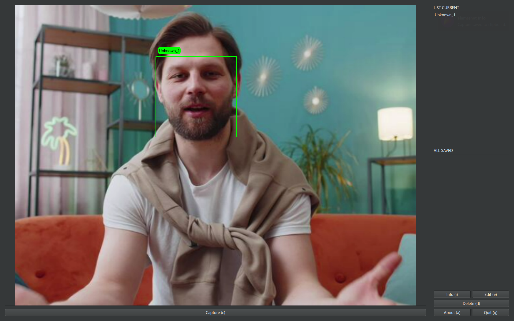
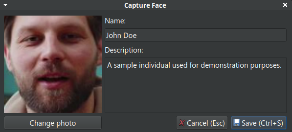
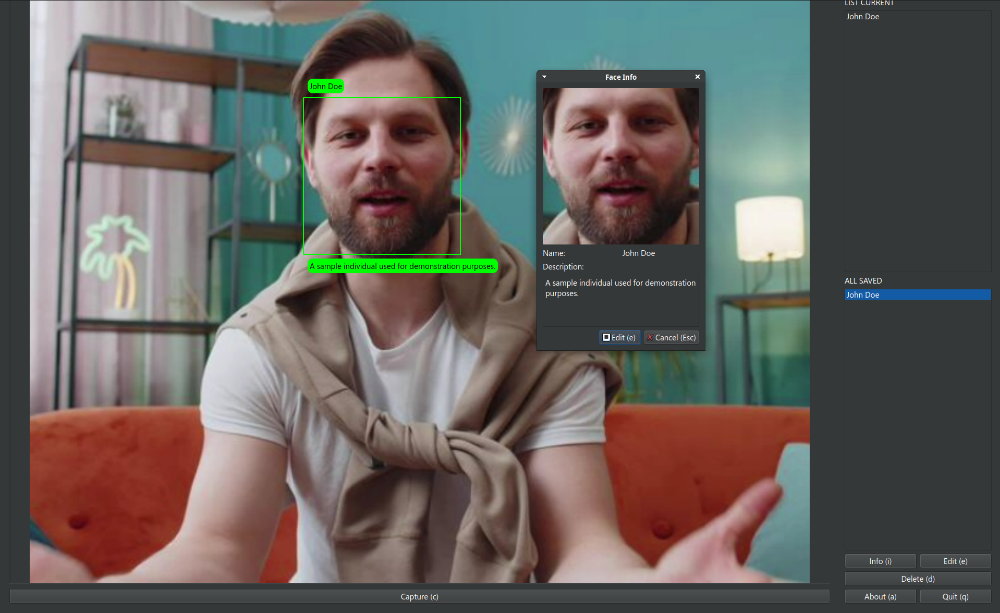

  <h2 align="center">
    
    <br>
    PyFaceID
  </h2>

  <p align="center">
    <strong>Facial recognition system written in Python using OpenCV and the face_recognition library</strong>
  </p>

<p align="center">



</p>

## Features

- Real-time camera support
- Set video output source 
- Face detection and recognition 
- Save and edit face data 
- Intuitive PySide6 (Qt) interface 
- Hotkeys for quick access
- All faces data saved into `face_data/` directory which contains structured JSON about all faces 
- Saving face by placing image into `face_data/` before running program

## Main Hotkeys

- `v` – Toggle face landmarks
- `c` – Capture face
- `i` – View face information (read-only)
- `e` – Edit face information
- `d` – Delete face
- `a` – Open this window
- `q` – Exit the program

## Usage

Download the latest package from [releases page](https://github.com/mikroffarad/PyFaceID/releases/)

## Building from source:

For Debian/Ubuntu-based distros simply run `install.sh`

Manual building:  
- For Linux: make sure you have installed `cmake`, `python3` and other build tools (`build-essential` for Debian/Ubuntu, `base-devel` for Arch, other for your distro)
- For Windows: make sure you have properly installed CMake and latest Python version
  ```bash
  # Download this repo and navigate to it
  git clone https://github.com/mikroffarad/PyFaceID.git && cd PyFaceID

  # Create a Python virtual environment and activate it
  python3 -m venv venv
  source venv/bin/activate

  # Install all necessary dependencies
  pip install -r requirements.txt

  # Run the program
  python main.py
  ```